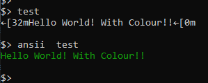

# ANSII

this is a simple program that enables ansii escape sequences for the programs that dont enable them and just expect them to work



## quick start
either download from releases or build yourself
```powershell
$ gcc .\main.c -o ansii
```
then copy it into your path or add the folder to the path

it should also work with most other compilers (untested though)

THIS IS WINDOWS ONLY